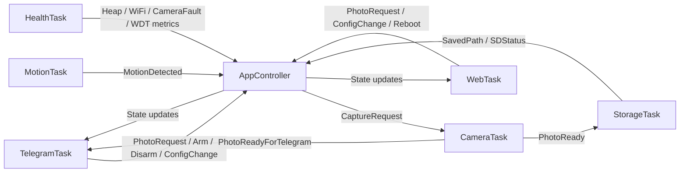
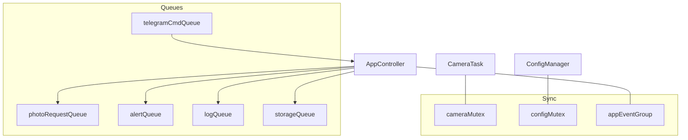
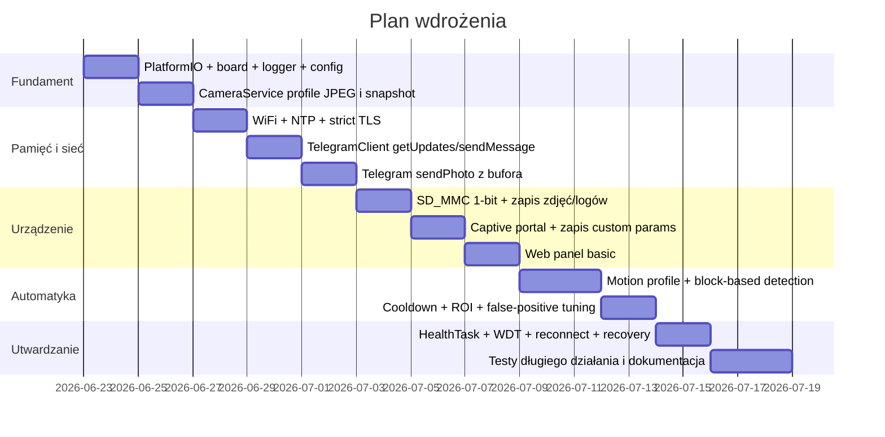

# Modułowy i stabilny projekt ESP32-CAM OV2640 w PlatformIO

## Podsumowanie wykonawcze

Dla pokazanej płytki najrozsądniejszy kierunek to **lokalna kamera-zdjęciownik z Telegramem, detekcją ruchu opartą o obraz, microSD i prostym panelem WWW**, a nie pełny streamer CCTV 24/7. Z dostarczonej specyfikacji wynika, że celem jest projekt modularny w PlatformIO + VS Code, z Arduino framework, Telegramem, microSD, captive portalem, FreeRTOS i sensownym loggingiem. W tej analizie przyjmuję wariant **AI‑Thinker style ESP32‑CAM z OV2640**, zgodnie z Twoją specyfikacją i zdjęciami. fileciteturn0file0

Najważniejsza decyzja techniczna nie dotyczy kamery, lecz **toolchainu**: oficjalny `platform-espressif32` w PlatformIO jest dziś aktualny jako platforma 7.0.1, ale nadal wystawia **Arduino 2.0.17**, podczas gdy oficjalny core `arduino-esp32` jest już na **3.3.10**. Dla nowego projektu z kamerą, nowym Network API i nowszym ekosystemem bibliotek, lepszym wyborem praktycznym jest dziś **pioarduino/platform-espressif32** z gałęzią Arduino 3.3.9 dla PlatformIO; nadal można używać `board = esp32cam`. citeturn10view0turn12view0turn8view1turn5view0turn32view0

Po stronie bibliotek rekomenduję: **oficjalny `esp32-camera`** do obsługi sensora, **`WiFiManager` tylko do captive portalu/provisioningu**, **`Preferences` do konfiguracji w NVS**, **`SD_MMC` do karty**, **wbudowany synchroniczny serwer HTTP/WebServer** do lokalnego panelu oraz **własny lekki `TelegramClient`** zamiast cięższego bota-ogólniaka. `UniversalTelegramBot` jest wygodny na start, ale sam README przyznaje, że long polling wiąże Arduino podczas oczekiwania, a API tej biblioteki opiera się szeroko o `String`; `AsyncTelegram2` jest dużo nowocześniejszy i nieblokujący, wspiera wysyłkę zdjęcia z raw buffera i ma świeże wydania, więc nadaje się jako szybki prototyp. Dla projektu nastawionego na stabilność i małą liczbę zależności końcowo lepszy jest jednak **cienki klient HTTPS** implementujący tylko `getUpdates`, `sendMessage`, `sendPhoto` i opcjonalnie `sendDocument`. citeturn30view9turn30view10turn30view0turn30view3turn20view0turn4view9turn5view3turn6view4

Detekcję ruchu bez PIR warto zrobić jako **niski profil detekcyjny + profil alarmowego zdjęcia**. Oficjalny sterownik kamery ostrzega, że formaty YUV/RGB mocno obciążają układ, szczególnie przy Wi‑Fi, natomiast JPEG jest preferowany do streamingu i pracy z wieloma buforami. Z drugiej strony przykład CameraWebServer pokazuje, że do przetwarzania obrazu stosuje się małe nie‑JPEG-owe profile, np. `RGB565` przy `240x240`. Najstabilniejszym kompromisem dla tego projektu jest więc: **mały profil detekcyjny w DRAM i z jednym framebufferem**, z porównywaniem bloków/ROI i adaptacją do zmian jasności, a po wykryciu ruchu lub komendzie `/photo` — **krótkie przełączenie do profilu JPEG VGA/SVGA**, zapis na SD i wysyłka na Telegram. citeturn5view2turn27view1turn36view2

Architektura zadaniowa powinna być modularna, ale nie „enterprise dla ESP32”. Najbardziej sensowny układ to: **`CameraTask` jako jedyny właściciel kamery**, **`MotionTask`**, **`TelegramTask`**, **`StorageTask`**, **`WebTask`** i lekki **`HealthTask`**. FreeRTOS Task Watchdog w ESP-IDF/Arduino jest właśnie po to, by wykrywać zadania, które nie oddają CPU; jednocześnie dokumentacja watchdogów jasno sugeruje minimalizowanie długich sekcji krytycznych oraz przenoszenie ciężkiej pracy z ISR do tasków. To dobrze pasuje do architektury z kolejkami: komendy, żądania zdjęcia, zdarzenia ruchu i logi przechodzą przez kolejki, a kamera i SD nie są używane współbieżnie „na dziko”. citeturn23view0turn23view1

## Co potwierdził research o płytce i toolchainie

Oficjalny przykład Espressifa dla CameraWebServer oraz plik `camera_pins.h` potwierdzają typowy pinout **AI‑Thinker ESP32‑CAM**: `PWDN=32`, `RESET=-1`, `XCLK=0`, `SIOD=26`, `SIOC=27`, `Y9=35`, `Y8=34`, `Y7=39`, `Y6=36`, `Y5=21`, `Y4=19`, `Y3=18`, `Y2=5`, `VSYNC=25`, `HREF=23`, `PCLK=22`, a LED lampy błyskowej siedzi na **GPIO4**. Ten sam przykład ustawia też `xclk_freq_hz = 20000000`, korzysta z `PIXFORMAT_JPEG`, `fb_count = 1` domyślnie, a przy wykrytej PSRAM przechodzi do `jpeg_quality = 10`, `fb_count = 2` i `CAMERA_GRAB_LATEST`; dodatkowo dla aktywnej kamery wyłącza usypianie Wi‑Fi (`WiFi.setSleep(false)`). citeturn28view0turn27view1turn4view2

Sterownik `esp32-camera` oficjalnie wspiera OV2640 do 1600×1200 i przypomina o dwóch kluczowych ograniczeniach. Po pierwsze, poza JPEG w rozdzielczości CIF i niższej, **PSRAM jest w praktyce wymagana**. Po drugie, formaty YUV/RGB „kładą” ESP32 dużo bardziej niż JPEG, zwłaszcza przy włączonym Wi‑Fi, bo zapis do PSRAM bywa zbyt wolny; z tego powodu autorzy zalecają raczej łapać **JPEG**, a dopiero potem konwertować, jeśli aplikacja potrzebuje postaci RGB/BMP. Oficjalna dokumentacja wyjaśnia też kompromis `fb_count`: **1 bufor** daje większą kontrolę i mniejsze obciążenie, **2+ bufory** zwiększają przepustowość, ale tylko sensownie w JPEG i kosztem pamięci/CPU. citeturn5view2turn36view1turn36view2

Po stronie PlatformIO dokumentacja płytki mówi wprost, żeby używać `board = esp32cam`, a manifest tej płytki ustawia już za nas kilka istotnych parametrów: `BOARD_HAS_PSRAM`, `-mfix-esp32-psram-cache-issue`, `flash_mode = dio`, `f_flash = 40 MHz`, `f_cpu = 240 MHz`, domyślny Arduino linker script `esp32_out.ld`, partycje `huge_app.csv` oraz `upload.speed = 460800`. To jest dobry punkt wyjścia i nie ma zysku z udawania w `platformio.ini`, że to `esp32dev`. citeturn5view0turn32view0

Największy praktyczny problem toolchainu jest dziś taki, że oficjalne PlatformIO 7.0.1 wspiera dla `espressif32` **Arduino 2.0.17**, podczas gdy oficjalny upstream `arduino-esp32` ma świeże wydanie **3.3.10**. Fork **pioarduino/platform-espressif32** publikuje wydania dla PlatformIO oparte o **Arduino 3.3.9**, a changelog tego forka wprost wspomina o aktualizacji Arduino, narzędzi oraz ulepszeniach konfiguracji PSRAM. Z punktu widzenia kamery i długowieczności projektu oznacza to, że najlepszą praktyką na dziś jest **zostawić `board = esp32cam`, ale przejść z oficjalnego `platform = espressif32` na pioarduino**. citeturn10view0turn12view0turn8view1

Moja rekomendacja dla `platformio.ini` jest więc następująca: **PlatformIO + pioarduino + `board = esp32cam` + upload 460800 + monitor 115200 + `WiFi.setSleep(false)` w runtime + bez OTA + bez SPIFFS/LittleFS w pierwszej wersji, bo i tak używasz microSD**. Zostawiłbym też `huge_app.csv` na etap stabilizacyjny; własne partycje warto wprowadzić dopiero wtedy, gdy kod wyraźnie urośnie powyżej tego, co zostawia `huge_app`, lub gdy zapragniesz dodać coredump i wydzielone miejsce na zasoby. W samym przykładzie CameraWebServer Espressif ostrzega ponadto, że dla wysokiej jakości JPEG i UXGA trzeba mieć przynajmniej **3 MB APP space**, więc domyślny wybór „dużej” aplikacji jest tu uzasadniony. citeturn32view0turn27view0

## Biblioteki i decyzje technologiczne

Poniżej jest zestawienie bibliotek i komponentów, które naprawdę mają sens dla tego projektu.

| Biblioteka / komponent | Do czego | Plusy | Minusy / ryzyka | Decyzja |
|---|---|---|---|---|
| `espressif/esp32-camera` | kamera OV2640, framebuffery, konwersje `frame2jpg`, `frame2bmp` | oficjalny sterownik Espressifa, aktualne wydania, przykłady pinoutu i konfiguracji, konwersje formatów w pakiecie citeturn3view0turn36view2 | wymaga ostrożnego doboru profilu pamięci i formatów, RGB/YUV pod Wi‑Fi są kosztowne citeturn5view2 | **tak, obowiązkowo** |
| `WiFiManager` | pierwsze uruchomienie, captive portal, custom params | działa z ESP32 Arduino, ma DNS/WebServer, własne parametry, tryb non‑blocking, fallback portal citeturn37view1turn34view0turn34view1 | README sam ostrzega, że dokumentacja jest nie w pełni aktualna; trzeba samemu zapisać custom params do NVS citeturn37view0turn34view1 | **tak, tylko do provisioningu** |
| `Preferences` | trwała konfiguracja w NVS | oficjalne, dobrze pasuje do wielu małych wartości, utrzymuje dane po restarcie i zaniku zasilania citeturn24view0turn24view2 | nie do dużych blobów; zdjęcia i logi i tak muszą iść na SD citeturn24view0 | **tak** |
| `SD_MMC` | microSD | oficjalne API Arduino-ESP32, naturalny wybór dla ESP32‑CAM citeturn3view2turn25view3 | na ESP32-CAM 4‑bit SD koliduje z LED flash, bo D1 SD to GPIO4, a LED też siedzi na GPIO4; wymaga świadomego trybu pracy citeturn5view1turn28view0 | **tak, ale ostrożnie** |
| Wbudowany `WebServer` + osobno `WiFiManager` | panel lokalny | najmniej zależności, najprostszy model błędów, łatwiejszy debugging | nie jest async; nie nadaje się do ambitnego frontendu | **tak, do panelu admina** |
| `ESPAsyncWebServer` | alternatywa dla panelu | aktywny fork, kompatybilny z Arduino 2.x i 3.x, bogatsze możliwości i middleware citeturn34view3turn34view5 | większa złożoność, dodatkowe zależności, niepotrzebny w pierwszej wersji | **nie w MVP** |
| `UniversalTelegramBot` | szybki prototyp Telegrama | prosty start, dużo przykładów, zdjęcia z SD, klawiatury itp. citeturn29view0turn30view8 | zależność od ArduinoJson, szerokie użycie `String`, long polling blokuje pętlę/task podczas czekania citeturn30view8turn30view9turn30view10 | **nie jako finalne rozwiązanie** |
| `AsyncTelegram2` | nowocześniejszy prototyp Telegrama | nieblokujące I/O, świeże wydania, potrafi wysyłać zdjęcie z raw buffera, lepszy punkt startowy niż UATB citeturn30view0turn30view3 | kolejna warstwa abstrakcji; do finalnej kamery i tak wygodniej kontrolować upload samemu | **dobry prototyp, ale nie final** |
| własny `TelegramClient` na `NetworkClientSecure` | finalny transport Telegrama | pełna kontrola nad TLS, timeoutami, retry, multipart uploadem, brak zbędnych funkcji; `NetworkClientSecure` ma `setCACert`, `setCACertBundle` i `setInsecure()` citeturn20view0turn4view9turn5view3 | trzeba napisać klient i parser odpowiedzi | **tak, finalna rekomendacja** |
| `ArduinoJson` | lekki parser odpowiedzi Telegrama | działa na ESP32/PlatformIO, potrafi parsować bezpośrednio ze strumienia i filtrować duże wejścia, ma możliwość własnego alokatora dla PSRAM citeturn38view0 | trzeba pilnować rozmiarów dokumentów i nie rozwlekać JSON po całym projekcie | **tak, ale tylko lokalnie w TelegramClient/Config export** |

W praktyce oznacza to dwa rozsądne tryby pracy nad projektem. **Tryb bootstrap**: `AsyncTelegram2` do szybkiego sprawdzenia `/photo`, provisioning przez `WiFiManager`, reszta własna. **Tryb produkcyjny**: `esp32-camera` + `WiFiManager` + `Preferences` + `SD_MMC` + własny `TelegramClient` + prosty `WebServer`. Taki zestaw najlepiej odpowiada Twojemu priorytetowi: prostota działania urządzenia, ale modularny i czysty kod. citeturn30view0turn37view1turn24view0turn25view3turn20view0

## Rekomendowana architektura i zadania FreeRTOS

Sedno stabilności w ESP32‑CAM polega na tym, żeby **kamera miała jednego właściciela**. Oficjalny sterownik wymusza szybkie zwracanie framebufferów przez `esp_camera_fb_return()`, a przy złym zarządzaniu łatwo wejść w wycieki albo używanie bufora po czasie życia. Dlatego proponuję, żeby wyłącznie **`CameraTask`** wołał `esp_camera_fb_get()` i `esp_camera_fb_return()`, a cała reszta świata zgłaszała tylko żądania. Takie podejście jest bezpośrednio zgodne z wzorcem pokazywanym w oficjalnym README sterownika. citeturn36view1turn36view2

`MotionTask` nie powinien sam „tykać” kamery. Jego rola to okresowe wysyłanie do `CameraTask` żądania małej klatki detekcyjnej, obliczenie metryk różnicy i ewentualne wystawienie zdarzenia `MOTION_DETECTED`. `TelegramTask` robi tylko long polling (`getUpdates`) i zamienia komendy na zdarzenia aplikacyjne. `StorageTask` zapisuje pliki na SD i rotuje katalogi. `WebTask` obsługuje panel oraz serwuje ostatnie zdjęcie. `HealthTask` monitoruje stan Wi‑Fi, free heap, min heap, PSRAM i ewentualne błędy kamery, a także karmi watchdoga dla obserwowanych tasków. Taki układ naturalnie rozdziela odpowiedzialności i ogranicza miejsca, w których można zablokować system. ESP‑IDF dokumentuje Task Watchdog dokładnie jako mechanizm wykrywający taski, które za długo nie oddają CPU. citeturn23view0turn23view1



Do komunikacji proponuję niewielki, bardzo przewidywalny zestaw prymitywów:



Praktycznie rekomenduję następujące role:

- **`CameraTask`**: profil detekcyjny / profil zdjęcia, kontrola flash LED, retry po błędzie sensora, opcjonalny reinit kamery.
- **`MotionTask`**: tylko analiza bloków z małej klatki i cooldown.
- **`TelegramTask`**: `getUpdates` z dodatnim timeoutem, bo oficjalne `getUpdates` wspiera long polling i stanowi, że short polling jest bardziej testowy; po każdej odpowiedzi trzeba podnieść `offset`, żeby nie dublować komend. citeturn4view9turn6view0
- **`StorageTask`**: jednokierunkowe zapisy na SD, tworzenie katalogów i rotacja.
- **`WebTask`**: panel statusu + akcje administracyjne.
- **`HealthTask`**: `WiFi reconnect`, sanity checks, WDT metrics, kontrolowany restart kamery.

Zabezpieczenie przed zawieszaniem powinno być wielowarstwowe. Na pierwszym poziomie — timeouty i retry. Na drugim — **reinit kamery**, a nie od razu pełny restart MCU, gdy capture zwraca błąd. Na trzecim — restart urządzenia tylko wtedy, gdy kolejne reinity zawiodą albo gdy `HealthTask` wykryje powtarzalną degradację pamięci. To jest zgodne z dokumentacją watchdogów: długie sekcje krytyczne mają być ograniczane, a ciężką pracę robią taski i kolejki, nie ISR-y ani spin‑loopy. citeturn23view0

## Strategie dla kamery, Telegrama, SD i provisioningu

### Kamera i profile pracy

Najpewniejszy profil alarmowego zdjęcia to klasyczne ustawienie z oficjalnego przykładu: `PIXFORMAT_JPEG`, `xclk_freq_hz = 20000000`, `fb_count = 1` dla większej kontroli albo `2` tylko wtedy, gdy naprawdę potrzebujesz bardziej responsywnego pipeline’u zdjęć/streamu, oraz `jpeg_quality` w okolicach 10–12. Oficjalny przykład CameraWebServer dokładnie tak ustawia kamerę, a README sterownika precyzuje, że `fb_count > 1` ma sens właściwie tylko z JPEG. citeturn27view1turn5view2turn36view1

Dla Telegrama nie opłaca się iść w UXGA „bo skoro się da”. Bot API dopuszcza zdjęcie do **10 MB**, ale sam ESP32‑CAM szybciej i stabilniej pracuje na **VGA albo SVGA**. To nie jest limit Telegrama, tylko wniosek z ograniczeń sterownika i pamięci: małe/średnie JPEG‑i z VGA/SVGA ograniczają czas kompresji, zużycie heap/PSRAM i ryzyko timeoutów HTTPS. `sendPhoto` oficjalnie oczekuje `multipart/form-data`, jeśli wysyłasz nowy plik, więc rozmiar zdjęcia przekłada się bezpośrednio na czas utrzymywania połączenia TLS. citeturn5view3turn6view4turn5view2

Do detekcji ruchu najgorszą opcją jest porównywanie „gołych” metryk JPEG, np. długości pliku lub kilku bajtów nagłówka. To jest tanie obliczeniowo, ale reaguje na ekspozycję, autoflicker i kompresję bardziej niż na realny ruch. Najlepszy kompromis dla tej klasy sprzętu to **siatka bloków na małej klatce**: 12×9 albo 16×12 bloków, liczony średni poziom jasności na blok, następnie porównanie z poprzednią klatką i z wolno aktualizowanym tłem. Ponieważ oficjalny sterownik pokazuje przetwarzanie na małym profilu nie‑JPEG, a równocześnie ostrzega przed RGB/YUV przy Wi‑Fi, zalecam tu dwa profile: **low-res RGB565/240×240 lub QQVGA do detekcji** z jednym buforem w DRAM, oraz **VGA/SVGA JPEG do zdjęcia alarmowego**. To jest już wniosek projektowy, ale mocno podparty ograniczeniami oficjalnego sterownika. citeturn27view1turn5view2turn36view2

Proponowany algorytm ruchu:

1. ignoruj pierwsze N klatek po starcie i po każdej rekonfiguracji;
2. policz średnią jasność w blokach tylko dla ROI, a nie dla całego kadru;
3. odejmij globalną zmianę jasności, żeby nie wzbudzać alarmu od chmury lub zapalonej lampy;
4. alarmuj dopiero wtedy, gdy przekroczony jest **licznik poruszonych bloków** oraz **próg sumy różnic**;
5. po alarmie narzuć **cooldown** i minimalny interwał między zdjęciami.

To daje dużo lepszą odporność na szum, autoexposure i niewielkie drgania niż prosta różnica całych klatek, a nadal mieści się w granicach ESP32.

### Telegram, TLS i autoryzacja

Bot API Telegrama jest bardzo proste do ręcznej implementacji. Do odbioru komend wystarczy `getUpdates` z long pollingiem; oficjalna dokumentacja mówi wprost, że `timeout` powinien być dodatni, a short polling praktycznie jest trybem testowym. Po każdej odpowiedzi trzeba zwiększyć `offset`, żeby potwierdzić aktualizacje i nie czytać ich ponownie. Do wysyłki zdjęcia używasz `sendPhoto`, gdzie nowy plik wysyła się przez `multipart/form-data`. Jeśli zechcesz kiedyś wysłać log archiwalny, `sendDocument` ma limit **50 MB**. citeturn4view9turn6view0turn5view3turn6view4

Od strony bezpieczeństwa i niezawodności proponuję ten model:

- **strict TLS** jako domyślny tryb produkcyjny przez `setCACert()` lub `setCACertBundle()`;
- **`setInsecure()` tylko w buildzie developerskim**, bo sam nagłówek `NetworkClientSecure` opisuje tę ścieżkę jako „VERY INSECURE!”. citeturn20view0
- po starcie: najpierw Wi‑Fi, potem synchronizacja czasu, dopiero potem połączenia HTTPS z walidacją certyfikatu; to jest wniosek praktyczny wynikający z użycia walidacji TLS i oficjalnych mechanizmów synchronizacji czasu/SNTP. citeturn20view0turn22view0
- retry z backoffem, ale bez agresywnego floodu;
- osobna **whitelist chat ID**;
- redakcja tokena w logach i panelu;
- pierwsze parowanie przez zasadę, że bot może pisać do użytkownika dopiero po tym, gdy użytkownik pierwszy do niego napisze — tę praktyczną uwagę ma nawet README UniversalTelegramBot. citeturn30view10

Komendy, które mają sens w wersji pierwszej: `/start`, `/stop`, `/photo`, `/status`, `/help`, `/flash_on`, `/flash_off`, `/flash_auto`, `/sensitivity`, `/cooldown`, `/logs`, opcjonalnie `/reboot`. Dla prywatności ważne jest, żeby `/stop` naprawdę rozbrajał automatyczne zdjęcia; wtedy manualne `/photo` może nadal działać, albo możesz dodać twardszy tryb `/privacy`, w którym wyłączone jest także robienie zdjęć po stronie automatyki lokalnej.

### SD, flash LED, captive portal i panel WWW

Na ESP32-CAM masz istotny konflikt sprzętowy: w mapowaniu SD_MMC dla ESP32 linia **D1** jest na **GPIO4**, a w AI‑Thinker LED flash też jest na **GPIO4**. Zestawienie tych dwóch oficjalnych map prowadzi do prostego wniosku: **pełne 4‑bit SD_MMC koliduje z LED flash**, więc jeżeli chcesz zachować lampę błyskową i zarazem kartę, najbardziej przewidywalny wariant to **SD_MMC w trybie 1‑bit** albo bardzo ostrożne sterowanie LED tylko wtedy, gdy karta nie jest aktywna. Dokumentacja SD_MMC pokazuje też, że na ESP32 nie da się zmienić defaultowych pinów przez `setPins()` tak, jak na niektórych nowszych układach. citeturn5view1turn25view3turn28view0

Praktyczna polityka plików na SD powinna być prosta: `/photos/manual`, `/photos/motion`, `/logs`, `/config/export`. `StorageTask` powinien tworzyć katalogi przy starcie, a po każdym zapisie egzekwować limit typu „ostatnie N zdjęć per kategoria” albo limit zajętego miejsca. Gdy karty nie ma albo mount się wywali, aplikacja nie może umrzeć: zdjęcie nadal może być wysłane na Telegram, a log powinien trafić do RAM-owego ring buffera i na Serial. Oficjalne przykłady `SD_MMC` w Arduino-ESP32 pokazują dokładnie taki model wykrywania: `SD_MMC.begin()`, potem `cardType()`, obsługa `CARD_NONE`, tworzenie katalogów, listowanie, zapis i odczyt. citeturn25view3

Provisioning najlepiej zrealizować przez **WiFiManager**, ale tylko raz — do zebrania SSID, hasła, tokena bota, chat ID, host name, hasła do panelu i parametrów motion. WiFiManager oficjalnie obsługuje **custom parameters**, portal captive, DNS/WebServer oraz tryb non‑blocking; jednocześnie README sam przyznaje, że dokumentacja bywa nieaktualna, więc warto opakować go cienką własną klasą `CaptivePortalService`, zamiast rozlewać wywołania tej biblioteki po całym projekcie. Konfigurację zapisuj w **Preferences/NVS**, bo ta biblioteka jest przeznaczona właśnie do „wielu małych wartości”, a nie do dużych blobów. Eksport/import do JSON na SD można dodać jako funkcję administracyjną. citeturn37view0turn37view1turn34view1turn24view0turn24view2

Dla lokalnego panelu WWW sugeruję minimalizm: status Wi‑Fi, status Telegrama, armed/disarmed/privacy, heap/PSRAM, status SD, czas ostatniego ruchu, `Capture test`, `Download last photo`, `Save config`, `Restart`, `Reset provisioning`, `Show recent logs`. Przy Twoim priorytecie „prostota i stabilność” nie ma potrzeby od razu iść w async serwer. W praktyce wygodniejszy będzie prosty runtime panel na wbudowanym synchronicznym HTTP, a `WiFiManager` zostanie jedynie provisioningowym portalem AP. Zawsze zakładaj, że ten panel działa **tylko w LAN**, bez publikowania do internetu.

## Ryzyka, plan wdrożenia i minimalny szkielet projektu

Największe ryzyka techniczne są cztery. Pierwsze to **zasilanie**: ESP32‑CAM z Wi‑Fi i kamerą potrafi być kapryśny przy słabym 5 V; problemy będą wyglądały jak losowe restarty, błędy kamery lub zawieszki TLS. Drugie to **konflikt SD/LED**, który omówiłem wyżej. Trzecie to **heap/PSRAM fragmentation**, szczególnie jeśli w wielu miejscach będziesz budował duże `String` i kopiował JPEG‑i. Czwarte to **nadmierny entuzjazm architektoniczny**: jeśli od razu zrobisz streaming, async web, provisioning, Telegram, rotację plików i motion detection w jednym skoku, debugging stanie się nieproporcjonalnie trudny. Oficjalne materiały Espressifa o watchdogach i kamerze bardzo dobrze wspierają wniosek odwrotny: małe taski, krótkie ścieżki krytyczne, ograniczanie kosztownych operacji, szybkie oddawanie framebufferów i odzyskiwanie błędów warstwowo. citeturn23view0turn5view2turn36view2

Rekomendowana kolejność implementacji jest taka:



Minimalny, kompilowalny szkielet powinien już od pierwszego commita narzucać modularność. Poniżej masz bazę, którą potraktowałbym jako **następny krok po researchu**. Konfiguracja zakłada PlatformIO z pioarduino, bo to dziś najprakmatyczniejsza droga do Arduino‑ESP32 3.x w VS Code. Ta decyzja wynika z rozjazdu między aktualnym upstream Arduino‑ESP32 a oficjalnym `platform-espressif32` w PlatformIO. citeturn12view0turn10view0turn8view1

```ini
; platformio.ini
[env:esp32cam]
platform = https://github.com/pioarduino/platform-espressif32/releases/download/55.03.39/platform-espressif32.zip
board = esp32cam
framework = arduino

upload_speed = 460800
monitor_speed = 115200
monitor_filters = esp32_exception_decoder, time

board_build.partitions = huge_app.csv

build_flags =
  -DCORE_DEBUG_LEVEL=3
  -DAPP_USE_WIFI_MANAGER=1
  -DAPP_LOG_TO_SD=1
  -DAPP_LOG_TO_TELEGRAM=1
  -DAPP_ENABLE_WEB_PANEL=1
  -DAPP_ENABLE_SD=1
  -DAPP_ENABLE_FLASH_LED=1

lib_deps =
  tzapu/WiFiManager
  bblanchon/ArduinoJson
```

```cpp
// include/BoardPins.h
#pragma once

namespace BoardPins {
constexpr int PWDN  = 32;
constexpr int RESET = -1;
constexpr int XCLK  = 0;
constexpr int SIOD  = 26;
constexpr int SIOC  = 27;

constexpr int Y9 = 35;
constexpr int Y8 = 34;
constexpr int Y7 = 39;
constexpr int Y6 = 36;
constexpr int Y5 = 21;
constexpr int Y4 = 19;
constexpr int Y3 = 18;
constexpr int Y2 = 5;

constexpr int VSYNC = 25;
constexpr int HREF  = 23;
constexpr int PCLK  = 22;

constexpr int FLASH_LED = 4;
}
```

```cpp
// include/AppTypes.h
#pragma once

#include <Arduino.h>

enum class ArmState : uint8_t {
  Disarmed,
  Armed,
  Privacy
};

enum class FlashMode : uint8_t {
  Off,
  On,
  Auto
};

enum class LogLevel : uint8_t {
  Debug,
  Info,
  Warn,
  Error
};

struct AppConfig {
  char hostname[32] = "esp32cam";
  bool wifiConfigured = false;
  bool telegramConfigured = false;

  char telegramToken[96] = {0};
  char telegramChatId[24] = {0};
  char panelUser[16] = "admin";
  char panelPass[32] = "admin";

  ArmState startState = ArmState::Disarmed;
  FlashMode flashMode = FlashMode::Auto;

  uint8_t motionSensitivity = 5;
  uint16_t motionCooldownSec = 30;
  uint16_t minDetectIntervalMs = 750;

  uint8_t jpegQuality = 12;
  uint8_t logLevel = static_cast<uint8_t>(LogLevel::Info);

  bool savePhotosToSd = true;
  bool sendWarnErrorToTelegram = true;
};

struct AppState {
  ArmState armState = ArmState::Disarmed;
  bool wifiConnected = false;
  bool telegramReady = false;
  bool sdMounted = false;
  bool timeSynced = false;
  bool cameraReady = false;
  bool flashOn = false;

  uint32_t lastMotionMillis = 0;
  uint32_t lastPhotoMillis = 0;
};
```

```cpp
// src/logging/Logger.h
#pragma once

#include <Arduino.h>
#include "../../include/AppTypes.h"

class Logger {
public:
  void begin();
  void setLevel(LogLevel level);
  void log(LogLevel level, const char* tag, const char* msg);
  void logf(LogLevel level, const char* tag, const char* fmt, ...);

private:
  LogLevel level_ = LogLevel::Info;
};

extern Logger Log;

#define LOGD(tag, msg) Log.log(LogLevel::Debug, tag, msg)
#define LOGI(tag, msg) Log.log(LogLevel::Info,  tag, msg)
#define LOGW(tag, msg) Log.log(LogLevel::Warn,  tag, msg)
#define LOGE(tag, msg) Log.log(LogLevel::Error, tag, msg)
```

```cpp
// src/logging/Logger.cpp
#include "Logger.h"
#include <stdarg.h>

Logger Log;

void Logger::begin() {
  Serial.begin(115200);
  delay(50);
}

void Logger::setLevel(LogLevel level) {
  level_ = level;
}

void Logger::log(LogLevel level, const char* tag, const char* msg) {
  if (static_cast<uint8_t>(level) < static_cast<uint8_t>(level_)) return;
  Serial.printf("[%lu] [%s] %s\n", millis(), tag, msg);
}

void Logger::logf(LogLevel level, const char* tag, const char* fmt, ...) {
  if (static_cast<uint8_t>(level) < static_cast<uint8_t>(level_)) return;
  char buf[256];
  va_list args;
  va_start(args, fmt);
  vsnprintf(buf, sizeof(buf), fmt, args);
  va_end(args);
  Serial.printf("[%lu] [%s] %s\n", millis(), tag, buf);
}
```

```cpp
// src/config/ConfigManager.h
#pragma once

#include <Preferences.h>
#include "../../include/AppTypes.h"

class ConfigManager {
public:
  bool begin();
  bool load(AppConfig& cfg);
  bool save(const AppConfig& cfg);
  bool clear();

private:
  Preferences prefs_;
};

extern ConfigManager Config;
```

```cpp
// src/config/ConfigManager.cpp
#include "ConfigManager.h"
#include "../logging/Logger.h"
#include <cstring>

ConfigManager Config;

bool ConfigManager::begin() {
  return prefs_.begin("app", false);
}

bool ConfigManager::load(AppConfig& cfg) {
  strlcpy(cfg.hostname, prefs_.getString("host", cfg.hostname).c_str(), sizeof(cfg.hostname));
  strlcpy(cfg.telegramToken, prefs_.getString("tg_token", "").c_str(), sizeof(cfg.telegramToken));
  strlcpy(cfg.telegramChatId, prefs_.getString("tg_chat", "").c_str(), sizeof(cfg.telegramChatId));
  strlcpy(cfg.panelUser, prefs_.getString("panel_u", cfg.panelUser).c_str(), sizeof(cfg.panelUser));
  strlcpy(cfg.panelPass, prefs_.getString("panel_p", cfg.panelPass).c_str(), sizeof(cfg.panelPass));

  cfg.motionSensitivity = prefs_.getUChar("motion_s", cfg.motionSensitivity);
  cfg.motionCooldownSec = prefs_.getUShort("motion_cd", cfg.motionCooldownSec);
  cfg.minDetectIntervalMs = prefs_.getUShort("motion_iv", cfg.minDetectIntervalMs);
  cfg.jpegQuality = prefs_.getUChar("jpeg_q", cfg.jpegQuality);
  cfg.logLevel = prefs_.getUChar("log_lvl", cfg.logLevel);
  cfg.savePhotosToSd = prefs_.getBool("sd_save", cfg.savePhotosToSd);
  cfg.sendWarnErrorToTelegram = prefs_.getBool("tg_err", cfg.sendWarnErrorToTelegram);

  cfg.telegramConfigured = cfg.telegramToken[0] != '\0' && cfg.telegramChatId[0] != '\0';
  return true;
}

bool ConfigManager::save(const AppConfig& cfg) {
  prefs_.putString("host", cfg.hostname);
  prefs_.putString("tg_token", cfg.telegramToken);
  prefs_.putString("tg_chat", cfg.telegramChatId);
  prefs_.putString("panel_u", cfg.panelUser);
  prefs_.putString("panel_p", cfg.panelPass);
  prefs_.putUChar("motion_s", cfg.motionSensitivity);
  prefs_.putUShort("motion_cd", cfg.motionCooldownSec);
  prefs_.putUShort("motion_iv", cfg.minDetectIntervalMs);
  prefs_.putUChar("jpeg_q", cfg.jpegQuality);
  prefs_.putUChar("log_lvl", cfg.logLevel);
  prefs_.putBool("sd_save", cfg.savePhotosToSd);
  prefs_.putBool("tg_err", cfg.sendWarnErrorToTelegram);
  return true;
}

bool ConfigManager::clear() {
  return prefs_.clear();
}
```

```cpp
// src/camera/CameraService.h
#pragma once

#include <Arduino.h>
#include <esp_camera.h>

class CameraService {
public:
  bool begin();
  bool capture(camera_fb_t*& fb);
  void release(camera_fb_t* fb);
  void setFlash(bool on);

private:
  bool initialized_ = false;
};

extern CameraService Camera;
```

```cpp
// src/camera/CameraService.cpp
#include "CameraService.h"
#include "../../include/BoardPins.h"
#include "../logging/Logger.h"

CameraService Camera;

bool CameraService::begin() {
  camera_config_t config = {};
  config.ledc_channel = LEDC_CHANNEL_0;
  config.ledc_timer = LEDC_TIMER_0;
  config.pin_d0 = BoardPins::Y2;
  config.pin_d1 = BoardPins::Y3;
  config.pin_d2 = BoardPins::Y4;
  config.pin_d3 = BoardPins::Y5;
  config.pin_d4 = BoardPins::Y6;
  config.pin_d5 = BoardPins::Y7;
  config.pin_d6 = BoardPins::Y8;
  config.pin_d7 = BoardPins::Y9;
  config.pin_xclk = BoardPins::XCLK;
  config.pin_pclk = BoardPins::PCLK;
  config.pin_vsync = BoardPins::VSYNC;
  config.pin_href = BoardPins::HREF;
  config.pin_sccb_sda = BoardPins::SIOD;
  config.pin_sccb_scl = BoardPins::SIOC;
  config.pin_pwdn = BoardPins::PWDN;
  config.pin_reset = BoardPins::RESET;
  config.xclk_freq_hz = 20000000;
  config.pixel_format = PIXFORMAT_JPEG;
  config.frame_size = psramFound() ? FRAMESIZE_VGA : FRAMESIZE_QVGA;
  config.jpeg_quality = psramFound() ? 12 : 14;
  config.fb_count = 1;
  config.grab_mode = CAMERA_GRAB_WHEN_EMPTY;
  config.fb_location = psramFound() ? CAMERA_FB_IN_PSRAM : CAMERA_FB_IN_DRAM;

  pinMode(BoardPins::FLASH_LED, OUTPUT);
  digitalWrite(BoardPins::FLASH_LED, LOW);

  const esp_err_t err = esp_camera_init(&config);
  if (err != ESP_OK) {
    LOGE("CAM", "esp_camera_init failed");
    return false;
  }

  initialized_ = true;
  LOGI("CAM", "camera initialized");
  return true;
}

bool CameraService::capture(camera_fb_t*& fb) {
  if (!initialized_) return false;
  fb = esp_camera_fb_get();
  return fb != nullptr;
}

void CameraService::release(camera_fb_t* fb) {
  if (fb) esp_camera_fb_return(fb);
}

void CameraService::setFlash(bool on) {
  digitalWrite(BoardPins::FLASH_LED, on ? HIGH : LOW);
}
```

```cpp
// src/motion/MotionDetector.h
#pragma once

#include <Arduino.h>
#include "../../include/AppTypes.h"

class MotionDetector {
public:
  void begin(uint8_t sensitivity);
  bool detectPlaceholder();

private:
  uint8_t sensitivity_ = 5;
};

extern MotionDetector Motion;
```

```cpp
// src/motion/MotionDetector.cpp
#include "MotionDetector.h"

MotionDetector Motion;

void MotionDetector::begin(uint8_t sensitivity) {
  sensitivity_ = sensitivity;
}

bool MotionDetector::detectPlaceholder() {
  // TODO:
  // - low-res detection profile
  // - block grid / ROI
  // - adaptive lighting baseline
  // - cooldown handled by AppController
  (void)sensitivity_;
  return false;
}
```

```cpp
// src/telegram/TelegramService.h
#pragma once

#include <Arduino.h>

class TelegramService {
public:
  bool begin(const char* token, const char* chatId);
  bool poll();
  bool sendMessage(const char* text);
  bool sendPhotoJpeg(const uint8_t* data, size_t len, const char* caption);

private:
  char token_[96] = {0};
  char chatId_[24] = {0};
};

extern TelegramService Telegram;
```

```cpp
// src/telegram/TelegramService.cpp
#include "TelegramService.h"
#include "../logging/Logger.h"
#include <cstring>

TelegramService Telegram;

bool TelegramService::begin(const char* token, const char* chatId) {
  strlcpy(token_, token ? token : "", sizeof(token_));
  strlcpy(chatId_, chatId ? chatId : "", sizeof(chatId_));
  LOGI("TG", "telegram stub initialized");
  return token_[0] != '\0' && chatId_[0] != '\0';
}

bool TelegramService::poll() {
  // TODO: implement getUpdates(long polling)
  return true;
}

bool TelegramService::sendMessage(const char* text) {
  (void)text;
  // TODO: implement HTTPS sendMessage with NetworkClientSecure
  return false;
}

bool TelegramService::sendPhotoJpeg(const uint8_t* data, size_t len, const char* caption) {
  (void)data;
  (void)len;
  (void)caption;
  // TODO: implement multipart/form-data sendPhoto
  return false;
}
```

```cpp
// src/app/AppController.h
#pragma once

#include "../../include/AppTypes.h"

class AppController {
public:
  bool begin();
  void loop();

private:
  AppConfig cfg_;
  AppState state_;
};

extern AppController App;
```

```cpp
// src/app/AppController.cpp
#include "AppController.h"
#include "../logging/Logger.h"
#include "../config/ConfigManager.h"
#include "../camera/CameraService.h"
#include "../motion/MotionDetector.h"
#include "../telegram/TelegramService.h"

AppController App;

bool AppController::begin() {
  Log.begin();
  LOGI("APP", "boot");

  if (!Config.begin()) {
    LOGE("APP", "config begin failed");
    return false;
  }

  Config.load(cfg_);
  Log.setLevel(static_cast<LogLevel>(cfg_.logLevel));

  if (!Camera.begin()) {
    LOGE("APP", "camera begin failed");
    return false;
  }
  state_.cameraReady = true;

  Motion.begin(cfg_.motionSensitivity);

  if (cfg_.telegramConfigured) {
    state_.telegramReady = Telegram.begin(cfg_.telegramToken, cfg_.telegramChatId);
  }

  state_.armState = cfg_.startState;
  LOGI("APP", "ready");
  return true;
}

void AppController::loop() {
  Telegram.poll();

  if (state_.armState == ArmState::Armed) {
    if (Motion.detectPlaceholder()) {
      LOGI("APP", "motion placeholder triggered");
    }
  }

  delay(50);
}
```

```cpp
// src/main.cpp
#include <Arduino.h>
#include "app/AppController.h"

void setup() {
  App.begin();
}

void loop() {
  App.loop();
}
```

To jest jeszcze dalekie od pełnej implementacji, ale już wymusza właściwe granice modułów: konfiguracja osobno, kamera osobno, Telegram osobno, logowanie osobno, a `main.cpp` pozostaje cienki. Taki kształt projektu jest zgodny z celem, który podałeś: kod ma być prosty w eksploatacji, ale wysokiej jakości, czytelny i gotowy do dalszej rozbudowy. fileciteturn0file0

Najkrótsza lista TODO dla właściwej implementacji wygląda tak:

1. ustabilizować toolchain i capture JPEG;
2. dodać Wi‑Fi + NTP + strict TLS;
3. zaimplementować minimalny `TelegramClient`;
4. dołożyć `SD_MMC` 1‑bit i zapis zdjęć/logów;
5. uruchomić `WiFiManager` z custom params;
6. dodać prosty runtime `WebPanel`;
7. wdrożyć motion detection z block grid i cooldownem;
8. na końcu dopiero dołożyć watchdog, retry policy, eksport konfiguracji i lepszą dokumentację.

Jeśli chcesz jednozdaniową rekomendację końcową: **buduj to na pioarduino + `board = esp32cam`, z własnym `TelegramClient`, `WiFiManager` tylko do provisioningu, `Preferences` do configu, `SD_MMC` w 1‑bit, `CameraTask` jako jedynym właścicielem kamery i detekcją ruchu opartą o blokową analizę małej klatki**. To jest dziś najbardziej pragmatyczna i najstabilniejsza ścieżka dla Twojej płytki. citeturn12view0turn32view0turn37view1turn24view0turn5view1turn23view0turn5view2